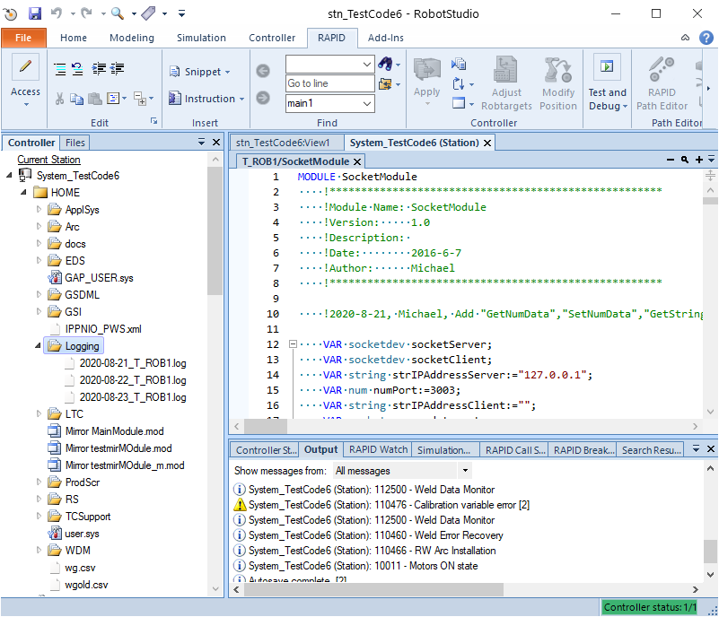
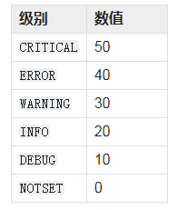
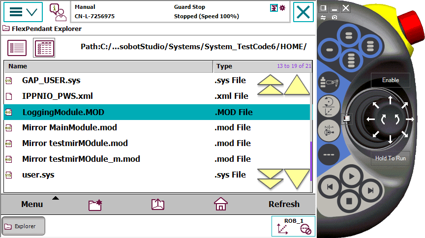
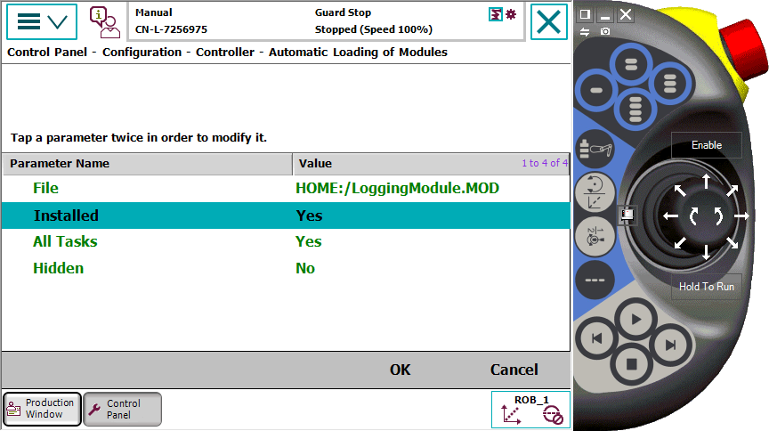
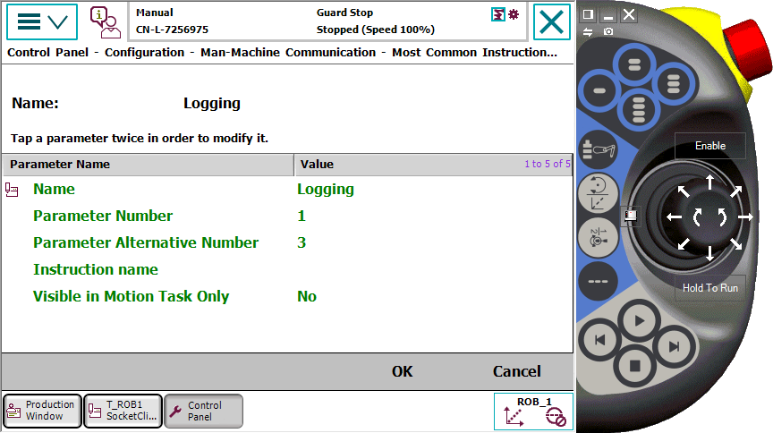
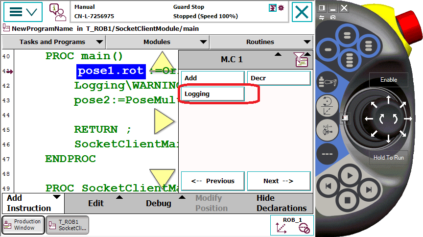
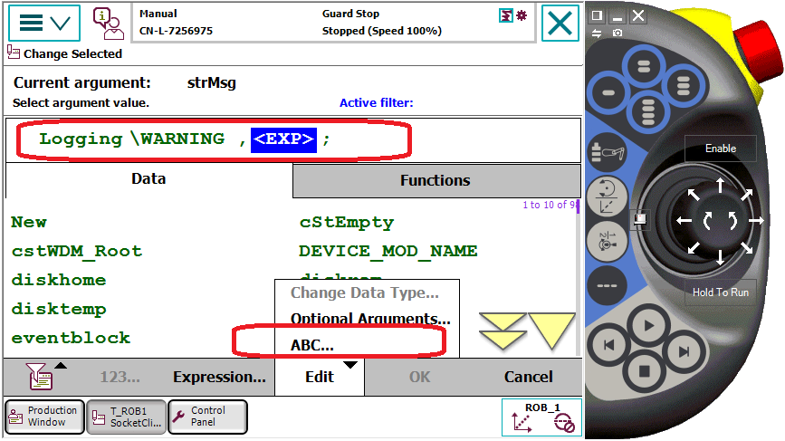

# LoggingModule使用手册

我们在使用ABB机器人编程时，为了代码调试和错误诊断方便，经常会使用***TPWrite***指令在示教器上输出程序运行的信息。但***TPWrite***指令功能有限，只能实时显示最近几条信息，而且不能永久保存。为了提高工作效率，帮助大家更有效的调试代码和错误诊断，这里介绍一个我经常使用的程序日志记录工具模块LoggingModule，该模块仿照Python的logging日志记录工具而开发。

## 初级用法

首先我们先看一下该工具最简单的使用方法：

	Logging "This is a DEBUG logging message.";

怎么样，代码非常简单，一旦工程师在程序里添加了该代码，运行后，机器人Home文件夹下就会创建一个新的目录“Logging”，且该目录下会生成一个按日期归类的日志文件，每一条日志都会包含“时间”，“日志级别”，“日志类别”和“日志内容”等信息，如下图所示：

**日志文件内容如下：**

	2020-08-21 11:40:25:ERRORING:SocketModule:The connection  is closed abnormally!
	2020-08-21 11:48:18:WARNING:SocketModule:Client 192.168.0.11 is connected.
	2020-08-21 11:48:19:DEBUG:SocketModule:Execute command 9 of GetSignalDo
	2020-08-21 11:48:19:DEBUG:SocketModule:GetSignalDo AliasIO : doTest1

## 高级用法

因为Logging模块是仿照Python的logging日志记录工具而开发的，所以它同时也具有了Python的logging日志模块的高级功能，我们看一下示例代码：

    !User can use this for testing
    !%"LoggingModule:LoggingTest"%;
    LOCAL PROC LoggingTest()
        SetTPHandlerLogLevel\WARNING;
        SetFileHandlerLogLevel\DEBUG;
        Logging\DEBUG\LoggerName:="LoggingModule","This is a DEBUG logging message.";
        Logging\INFO\LoggerName:="LoggingTest","This is a INFO logging message.";
        Logging\WARNING,"This is a WARNING logging message.";
        Logging\ERRORING,"This is a ERRORING logging message.";
        Logging\CRITICAL,"This is a CRITICAL logging message.";
        Logging\CRITICAL,"This is a CRITICAL logging message.This is a CRITICAL logging message.This is 80"\CloseFile;
    ENDPROC

### 日志级别

从上面代码，可以看到，Logging模块支持对日志内容进行分级。每个级别对应的数值如下表所示：

数值代表日志级别的优先级，在使用Logging指令输出日志内容时，我们可以指定当前日志内容的日志级别。例如有些日志只有在调试时才需要记录，在系统正常运行时不需要记录，此时就可以使用Logging\DEBUG可选参数限定该日志为调试信息；如果有些信息只是为了方便在程序运行时展示给用户，便于用户获知当前系统的运行状态，那么就可以使用Logging\INFO可选参数；只有当程序出现错误时，才需要记录的日志可以使用Logging\ERRORING可选参数。Logging指令默认的日志级别为***WARNING*** 。

### 设置全局日志级别

一共有两个指令用于设置全局日志级别：

	!用于控制示教器用户界面显示的日志内容，显示日志级别大于等于WARNING的所有日志
	SetTPHandlerLogLevel\WARNING

	!用于控制日志文档中需要写入的日志内容，记录日志级别大于等于DEBUG的所有日志 
	SetFileHandlerLogLevel\DEBUG

我们可以在***main*** 函数中定义当前程序的日志记录级别，如我们定义当前系统的日志级别为***WARNING*** ，那么我们在程序中Logging变量使用可选参数指定日志级别为***DEBUG*** 和***INFO*** 的日志字符串文本就**不会**记录到日志文件中。而日志级别可选参数指定为***WARNING*** ，***ERRORING*** 和***CRITICAL*** 的日志字符串文本**会**记录到日志文件中。

### 日志类别

当程序功能复杂，代码较多时，为了更好的检索日志，分析日志，我们还支持日志的类别属性，通过设置可选变量LoggerName，把日志进行分类，如可以按模块名进行分类，在该模块中，把所有日志全部添加可选变量\LoggerName:="SocketModule"，这样就可以在日志文件中直接检索SocketModule程序模块的相关的所有日志信息了。

### 日志输出方式

当前日志模块支持机器人示教器输出和文件输出两种方式，这两种方式应该已经满足日常调试需求了。当然，程序也支持自定义输出方式，如可以额外添加网络日志输出。

## 源代码

以下为日志模块的全部代码，供大家使用和参考：

	MODULE LoggingModule
	    !*****************************************************
	    !Module Name: LoggingModule
	    !Version:     1.0
	    !Description: This module imitates the functions and interfaces of Python logging module
	    !Date:        2019-1-20
	    !Author:      Michael
	    !*****************************************************
	    
	    !2019-5-8, Michael, Add LoggerName
	
	    !*****************************************************
	    !This module supports five levels: DEBUG(10), INFO(20), WARNING(30), ERRORING(40), CRITICAL(50)
	    !When a logging method is called on a logger, the logger compares its own level with
	    !the level associated with the method call. If the logger's level is higher than the method call's, no logging
	    !message is actually generated. This is the basic mechanism controlling the verbosity of logging output.
	    !The default logging level is WARNING
	    !*****************************************************
	
	    !The default logging level is WARNING which numeric value is equal to 30
	    !We recommand that set the FileHandlerLevel to 10, so that all the log messages will be writen to a log file
	    LOCAL PERS num FileHandlerLevel:=30;
	    LOCAL PERS num TPHandlerLevel:=30;
	
	    !Logging files are stored in "Home:/Logging"
	    !The format of file name is "year-month-day_TaskName.log"
	    LOCAL PERS string strFileHandlerFileName:="Logging/2019-01-23_T_ROB1.log";
	    LOCAL CONST string strFileHandlerDirectory:="Logging";
	    LOCAL VAR iodev iodevFileHandlerFile;
	
	    !A handler Procedure which writes formatted logging records to disk files.
	    !The maximum length of strMsg is 80.
	    !The FileHandler will open a logging file automatically, and keep the opened status until you close it.
	    !Normally, we don't need to close logging file.
	    !At Program Stop and moved PP to Main, any open file or serial channel in the program task will be closed
	    !and the I/O descriptor in the variable of type iodev will be reset.
	    !An exception to the rule is variables that are installed shared in the system of type global VAR or LOCAL VAR.
	    !Such file or serial channel belonging to the whole system will still be open.
	    LOCAL PROC FileHandler(num numHandlerLevel\string LoggerName,string strMsg\switch CloseFile)
	        VAR string strFileHandlerLevel:="WARNING";
	        VAR string strLoggerName:="root";
	        IF numHandlerLevel>=FileHandlerLevel THEN
	            TEST numHandlerLevel
	            CASE 10:
	                strFileHandlerLevel:="DEBUG";
	            CASE 20:
	                strFileHandlerLevel:="INFO";
	            CASE 40:
	                strFileHandlerLevel:="ERRORING";
	            CASE 50:
	                strFileHandlerLevel:="CRITICAL";
	            DEFAULT:
	                strFileHandlerLevel:="WARNING";
	            ENDTEST
	            !The standard date and time stamp format is "year-month-day hours:minutes:seconds", for example, "2016-06-14 22:00:00".
	            !The length of date and time stamp string is 19.        
	            IF Present(LoggerName) THEN
	                strLoggerName:=LoggerName;
	            ENDIF
	            Write iodevFileHandlerFile,CDate()+" "+CTime()+":"+strFileHandlerLevel+":"+strLoggerName+":"\NoNewLine;
	            Write iodevFileHandlerFile,strMsg;
	            IF Present(CloseFile) THEN
	                Close iodevFileHandlerFile;
	            ENDIF
	        ENDIF
	    ERROR
	        IF ERRNO=ERR_FILEACC THEN
	            IF CreateDir("HOME:",strFileHandlerDirectory) THEN
	                TPWrite "CreateDir 'HOME:\\"+strFileHandlerDirectory+"'";
	            ENDIF
	            strFileHandlerFileName:=strFileHandlerDirectory+"/"+CDate()+"_"+GetTaskName()+".log";
	            Close iodevFileHandlerFile;
	            Open "HOME:"\File:=strFileHandlerFileName,iodevFileHandlerFile\Append;
	            TPWrite "Logging file '"+strFileHandlerFileName+"' is opened";
	            SkipWarn;
	            RETRY;
	        ENDIF
	    ENDPROC
	
	    !Set the logging level of file handler.
	    PROC SetFileHandlerLogLevel(\switch DEBUG|switch INFO|switch WARNING|switch ERRORING|switch CRITICAL)
	        IF Present(DEBUG) THEN
	            FileHandlerLevel:=10;
	        ELSEIF Present(INFO) THEN
	            FileHandlerLevel:=20;
	        ELSEIF Present(ERRORING) THEN
	            FileHandlerLevel:=40;
	        ELSEIF Present(CRITICAL) THEN
	            FileHandlerLevel:=50;
	        ELSE
	            FileHandlerLevel:=30;
	        ENDIF
	    ENDPROC
	
	    !A handler Procedure which writes formatted logging records to disk files.
	    !The maximum length of strMsg is 77.
	    !If the length of strMsg is greater than 77, it will be truncated to 77 characters.
	    LOCAL PROC TPHandler(num numHandlerLevel\string LoggerName,string strMsg)
	        VAR string strTPMsg;
	        IF numHandlerLevel>=TPHandlerLevel THEN
	            IF StrLen(strMsg)<=77 THEN
	                strTPMsg:=ValToStr(TPHandlerLevel)+":"+strMsg;
	            ELSE
	                strTPMsg:=ValToStr(TPHandlerLevel)+":"+StrPart(strMsg,1,77);
	            ENDIF
	            TPWrite strTPMsg;
	        ENDIF
	    ENDPROC
	
	    !Set the logging level of teach flexpendant handler.
	    PROC SetTPHandlerLogLevel(\switch DEBUG|switch INFO|switch WARNING|switch ERRORING|switch CRITICAL)
	        IF Present(DEBUG) THEN
	            TPHandlerLevel:=10;
	        ELSEIF Present(INFO) THEN
	            TPHandlerLevel:=20;
	        ELSEIF Present(ERRORING) THEN
	            TPHandlerLevel:=40;
	        ELSEIF Present(CRITICAL) THEN
	            TPHandlerLevel:=50;
	        ELSE
	            TPHandlerLevel:=30;
	        ENDIF
	    ENDPROC
	
	    !Log a message with the integer severity 'level' on the root logger.
	    !This procedure will call log handler such as TPHandle and FileHandler.
	    !You can add new log handler to this procedure, for example EmailHandler, etc.
	    !LoggerName is used for classifying the log messages.
	    !For example, user can set the LoggerName to module name or feature purpose.
	    PROC Logging(\switch DEBUG|switch INFO|switch WARNING|switch ERRORING|switch CRITICAL\string LoggerName,string strMsg\switch CloseFile)
	        VAR num numHandlerLevel:=30;
	        IF Present(DEBUG) THEN
	            numHandlerLevel:=10;
	        ELSEIF Present(INFO) THEN
	            numHandlerLevel:=20;
	        ELSEIF Present(ERRORING) THEN
	            numHandlerLevel:=40;
	        ELSEIF Present(CRITICAL) THEN
	            numHandlerLevel:=50;
	        ELSE
	            numHandlerLevel:=30;
	        ENDIF
	        TPHandler numHandlerLevel\LoggerName?LoggerName,strMsg;
	        FileHandler numHandlerLevel\LoggerName?LoggerName,strMsg\CloseFile?CloseFile;
	    ENDPROC
	
	    !The user must make sure the parentDirectory is existed
	    LOCAL FUNC bool CreateDir(string parentDirectory,string dirName)
	        VAR dir directory;
	        VAR string filename;
	        OpenDir directory,parentDirectory;
	        WHILE ReadDir(directory,filename) DO
	            IF StrMap(dirName,STR_LOWER,STR_UPPER)=StrMap(filename,STR_LOWER,STR_UPPER) THEN
	                IF IsFile(parentDirectory+"\\"+dirName\Directory) THEN
	                    CloseDir directory;
	                    RETURN FALSE;
	                ELSE
	                    TPWrite "There is a file named '"+dirName+"' in directory '"+parentDirectory+"'";
	                    TPWrite "Try to delete it...";
	                    RemoveFile parentDirectory+"\\"+dirName;
	                    TPWrite "File '"+dirName+"' is deleted";
	                ENDIF
	            ENDIF
	        ENDWHILE
	        CloseDir directory;
	        MakeDir parentDirectory+"/"+dirName;
	        RETURN TRUE;
	
	    ERROR
	        IF ERRNO=ERR_FILEACC THEN
	            TPWrite "The "+parentDirectory+" points to a non-existing directory or the directory cannot be created.";
	            RAISE ERR_FILEACC;
	        ENDIF
	
	    ENDFUNC
	
	    !User can use this for testing
	    !%"LoggingModule:LoggingTest"%;
	    LOCAL PROC LoggingTest()
	        SetTPHandlerLogLevel\WARNING;
	        SetFileHandlerLogLevel\DEBUG;
	        Logging\DEBUG\LoggerName:="LoggingModule","This is a DEBUG logging message.";
	        Logging\INFO\LoggerName:="LoggingTest","This is a INFO logging message.";
	        Logging\WARNING,"This is a WARNING logging message.";
	        Logging\ERRORING,"This is a ERRORING logging message.";
	        Logging\CRITICAL,"This is a CRITICAL logging message.";
	        Logging\CRITICAL,"This is a CRITICAL logging message.This is a CRITICAL logging message.This is 80"\CloseFile;
	    ENDPROC
	
	ENDMODULE

## 使用方法

### 方法一

工程师在使用前，只需要把上述代码添加到机器人，就可以使用了。

### 方法二（强烈推荐)

- 工程师把代码保存到机器人Home文件夹下：

- 配置为自动导入该模块，重启系统。使用该方法，模块会被隐藏到系统中，防止用户意外修改和删除。

- 配置Most Common Instruction - List 1 (M.C 1)，重启系统后，logging指令就像系统指令一样显示在“添加指令”菜单中。

- 点击添加Logging指令，默认为WARNING日志级别，通过ABC输入按钮，输入日志文本，完成指令的添加。

通过以上两个方法中的任意一种，就可以在程序中自由输出日志信息了。